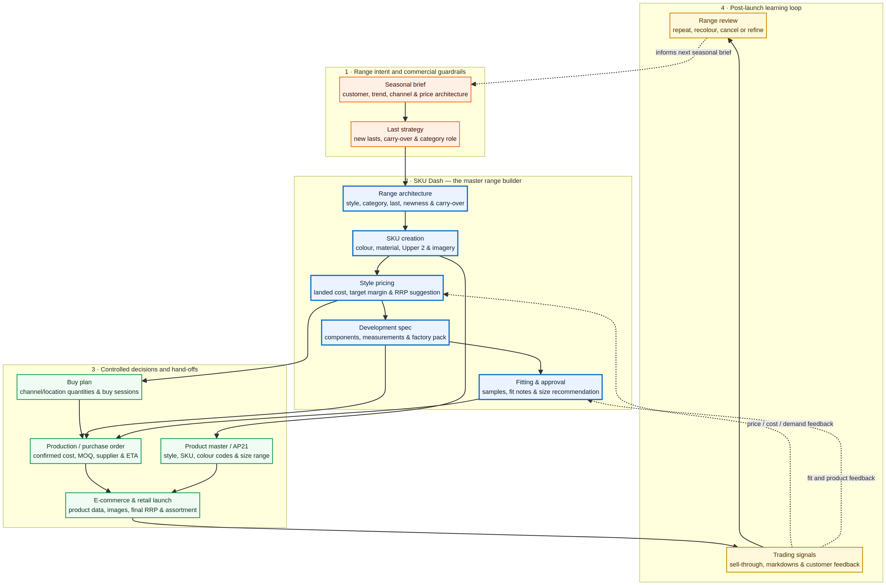

# SKU Dash: Tony Bianco’s Range Builder and Product-Development Starting Point

> **Positioning:** SKU Dash should become the controlled starting point for each seasonal range—before styles, SKUs, buy plans, product records or purchase orders are created elsewhere. It is the **range-definition source of truth**, not only a reporting dashboard.

## What SKU Dash is for

SKU Dash turns an approved seasonal idea into a structured, commercially viable product range. It holds the decisions that should be made once and then flow consistently to Development, Buying, Product Master/AP21, E-commerce and Planning.

| Business question | SKU Dash control point | Downstream use |
|---|---|---|
| What is the range? | Category, last, style, carry-over/newness, trend and cancellation status | Range review, merchandising, line plan |
| What colours/materials exist? | SKU-level colour/leather, Upper 2, imagery and SKU identity | Supplier development, product master, e-commerce |
| Is the style commercially viable? | Landed cost, target margin, RRP and price recommendation | Commercial sign-off, buy plan, retail pricing |
| Can it be made correctly? | Specs, components, measurements, saved row order and factory email packs | Factory/developer instruction |
| Does it fit and meet quality expectations? | Sample status, fitting sessions, fit notes, approval and sizing recommendation | Development approval, product content |
| How much and where do we buy? | Buy sessions, AU/USA/NYC/LA quantities and buy-sheet exports | Buy plan, purchase orders and allocation |
| Is the item ready for system creation? | AP21 fields, size range, colour codes and product exports | Product master / AP21 and launch preparation |

## Proposed operating flow

### 1. Define the range before product creation

Start with the seasonal brief: customer, trend, channel needs, price architecture and desired category mix. The range team uses SKU Dash to decide which lasts are new, which styles continue, which categories are being developed and where the gaps are.

**Output:** a coherent seasonal range architecture—not a loose spreadsheet list.

### 2. Build the product range in SKU Dash

For each style, create the product identity and all intended SKUs: last, category, colour, material, secondary upper where relevant, imagery and new/carry-over status. This is the point at which a style becomes an actionable development record.

The new **Style pricing** card belongs here. It captures:

- **Landed cost** in AUD
- **Target gross margin** (75% is the Buy Plan default)
- **RRP** including GST
- A suggested RRP rounded up to Tony Bianco’s observed retail price ladder
- A live achieved-margin check against the selected RRP
- Optional per-SKU RRP exceptions for colourways that genuinely need a different price

**Output:** a range that is both creative and commercially tested before it reaches a factory or buying plan.

### 3. Develop and approve the product

The Specs Library turns each product record into a factory-ready technical pack: construction components, measurements, material detail and individual SKU columns. Factory/developer recipient groups and in-app email attachments let the team send the current Excel spec directly from SKU Dash.

Fitting then closes the development loop with sample status, fitting sessions, comments, approval and customer-facing size recommendations.

**Output:** approved, buildable product information with a clear audit trail.

### 4. Create the buy and system hand-offs

Once the product and commercial data are ready:

- **Buy Sessions** turn range choices into quantities by channel/location.
- **Product Master / AP21 exports** turn approved style and SKU data into system-ready records.
- **Production / Purchase Order** uses approved specs, confirmed costs, supplier details and buy quantities.
- **E-commerce / Retail launch** receives final product data, imagery, price and assortment decisions.

SKU Dash should pass validated information out; it should not become a second purchase-order, warehouse or inventory-management system.

### 5. Learn and feed the next range

Post-launch signals—sell-through, markdown status, customer feedback, actual costs and product/fit learnings—should return to SKU Dash as a range-review input. Those decisions inform the next seasonal brief: repeat, recolour, expand, reduce or cancel.

## System boundaries and ownership

| Layer | Primary owner | SKU Dash role |
|---|---|---|
| Seasonal intent / range strategy | Product, Creative, Merchandise | Capture the approved range architecture |
| Style, SKU and technical data | Product Development | Maintain the working product definition and specs |
| Cost, margin and RRP | Merchandise / Commercial | Set targets, evaluate viability and approve price |
| Quantities and channel split | Buying / Planning | Build buy scenarios and export buy sheets |
| Supplier execution | Production / Sourcing | Receive specifications and confirmed hand-off data |
| Product master / AP21 | Product Operations | Receive controlled product/SKU export data |
| Product launch | E-commerce / Retail | Receive approved content, imagery, price and range status |
| Demand, inventory and allocations | Planning / Supply Chain | Consume SKU Dash range outputs; feed learnings back |

## Recommended governance rules

1. **Create once in SKU Dash.** A style, SKU name, Upper 2 identity, colour/material and price should be defined once before downstream entry.
2. **Use role-appropriate hand-offs.** Factories receive specs; Buying receives buy sheets; Product Operations receives AP21-ready fields—not one generic export for everyone.
3. **Keep the commercial decision visible.** RRP is not merely a web price; it should be visibly linked to landed cost and target margin at style creation.
4. **Allow exceptions without corrupting the range.** A style has one default RRP; a SKU override is only for genuine colourway-level exceptions.
5. **Close the loop.** Markdown, fit, cost and sales learnings are decision inputs for the next range, rather than isolated reports.

## Suggested headline for your wider business map

> **SKU Dash — Range Definition & Product Development Source of Truth**
>
> The system where Tony Bianco builds, prices, specifies, approves and hands off the seasonal product range before products are created in downstream systems.
